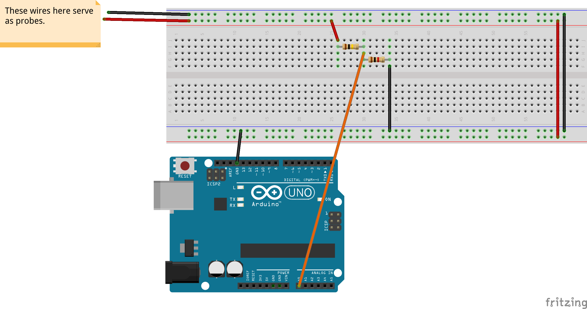

# Open Source Voltmeter 

A voltmeter, is simply a device to measure the voltage. There are so many ways that you can measure the voltage. 

The simplest way, which sometimes apply to batteries (like 9 volt batteries) is to use a conductive part of your body like your tongue to do the measurement. But can you say how much voltage is there? of course not. This method shows you _there's a voltage_. I personally did this to find out the battery is dead or not. 

There are some tools which are called _test light_ or _phase meter_ (I think you hear that name a lot if you're Iranian), which can be used on high voltage lines. But again, that thing also shows which wire is live. Useful for when you don't know which wire is live. It only shows _there is a voltage_. 

The third way, is using an analogue or digital voltmeter. They're always available in shops and can measure different things as well. This is why we call them "Multi-Meter". They can measure voltage, current, resistance and in more advanced ones, capacitance, inductance, frequency, diode and transistor stuff and even temperature. 

As I'm locked in my home, like most of you are, I decided to make my own volt meter. I worked with [Arduino](http://arduino.cc) boards a lot. I thought to myself, it can be a cool project to create a volt meter using Arduino. 

## How this project works (The simple explanation)

I had the formula which is used to drive sensors (such as LM35) in my mind. The formula is something like this for an Arduino Uno board : 

Input voltage is the voltage we have in the input, `5.0` is the _reference voltage_ which is five volts in most cases and the whole thing is divided by 1024, because it has to be converted to digital data in the microcontroller. Using that, I could easily make my very own voltmeter. 

Then, I decided to change it like this : 

So now, you have the knowledge of how to drive a sensor or how to make your board to a voltmeter. But, there are something you should be aware of. I listed them and I have the solutions further in this `README.md` file. 

### Problems with this equation and the simple circuit 

* No current limitation. High current, can easily kill a human, as well as high voltage. If we simply connect our board to any power source, we can easily make a permanent damage to our circuit. 
* No ability of voltages higher than Arduino's limitations. I'm not sure about that but I remember these guys can handle up to 12 volts on their _analogue_ pins and around 9 volts on their _digital_ pins. So, we can make some modifications to overcomes our limits!

## Modifications 

First, I made a voltage divider which can easily divide voltage by 100 : 

Then, I shorted the circuit ground to the board and wired the thing up like this : 

After all, I made my modifications to the formula as well : 

Then, I started programming the circuit! 

## Testing 

I tested using a bunch of power sources. The image below, shows the result of measurement of the voltage of an old cell phone battery: 

## TODO 

- [ ] Providing the LCD support 
- [ ] Providing current measurement to the mix 
- [ ] Providing resistance measurement to the mix